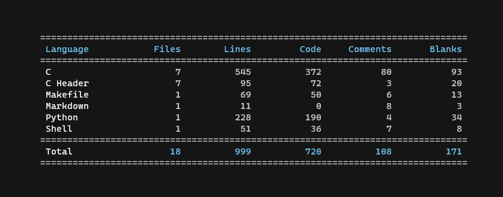

## Labirynt

Należy napisać program poszukujący drogi w wielowymiarowym labiryncie.

- wczytywanie wejścia z obsługą błędów
- podział kodu na moduły
- `makefile` do budowania i testowania
- skrypt w Bashu/Pythonie do testowania
- zwalnianie pamięci (xd)

Testy są dostępne [o tutaj](https://github.com/Kwasow/IPP_testy).
